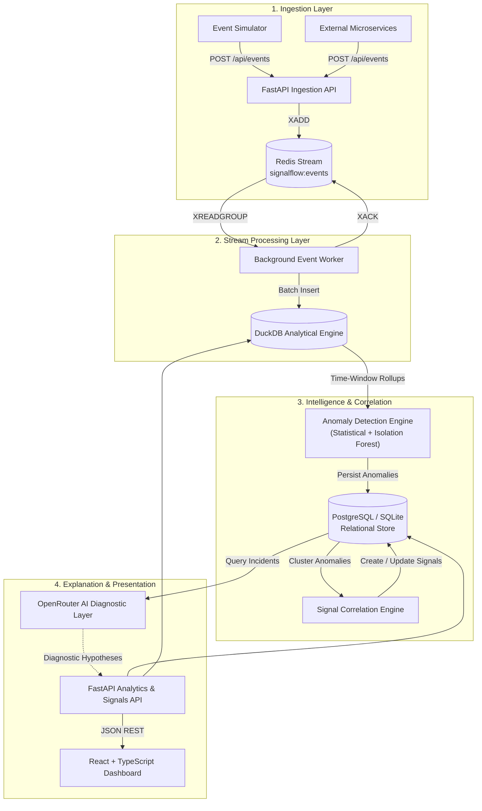

# SignalFlow — Business Event Intelligence & Anomaly Detection Platform

A resilient, observable event intelligence and anomaly detection platform engineered to ingest high-volume application telemetry, detect operational regressions in real time using statistical baselines and Isolation Forests, correlate multi-dimensional anomalies into cohesive incidents, and provide AI-assisted operational explanations.

[](#)
[](#)
[](#)
[](#)
[](#)
[](#)
[](#)
[](#)
[](#)

---

## 1. Overview

Modern distributed systems generate immense volumes of application telemetry: checkout events, authentication attempts, payment transactions, internal API calls, status codes, and latency measurements. Engineers and SREs cannot manually inspect this volume of continuous event streams.

**SignalFlow** solves this challenge by providing an end-to-end event intelligence pipeline that:
1. **Ingests** structured JSON business events via high-throughput HTTP endpoints.
2. **Buffers** events into append-only Redis Streams for decoupled, backpressure-safe consumption.
3. **Aggregates** rolling analytical time windows in an embedded DuckDB columnar engine.
4. **Detects** metric deviations via dual-layer detection: statistical baselines (Z-score, rolling standard deviation, percentage change) and machine learning (scikit-learn Isolation Forest).
5. **Correlates** related anomalies across the same service and region into unified operational incidents.
6. **Explains** detected incidents using OpenRouter LLM diagnostic summaries, generating operational hypotheses and recommended remediation actions.

### Concrete Example:

Under normal operating conditions, `payment-service` in the Pune region maintains an error rate below $2\%$ and response latencies around $320\text{ms}$.

If a third-party banking gateway experiences intermittent degradation:
* Error rate jumps abruptly to $35\%$.
* Average latency surges from $320\text{ms}$ to $2800\text{ms}$.
* Traffic retry loops elevate event volume.

Rather than alerting on three disjointed metrics, SignalFlow detects all three deviations, clusters them into a single **CRITICAL** incident titled *"Payment Service Degradation"*, and generates actionable diagnostic hypotheses.

> **Operational Note:** AI-generated incident explanations are diagnostic hypotheses based on available telemetry patterns, not verified root causes. Deterministic backend algorithms detect and classify all anomalies.

---

## 2. Key Features

* **High-Throughput Ingestion API**: Validated `POST /api/events` endpoint powered by FastAPI and Pydantic v2 with server-side unique event ID generation.
* **Redis Streams Buffer**: Asynchronous stream buffering (`signalflow:events`) with consumer group fan-out and at-least-once delivery guarantees.
* **Background Stream Worker**: Resilient background daemon (`EventWorker`) consuming batches with `XREADGROUP` and `XACK`.
* **Embedded Columnar Storage**: In-process DuckDB analytical engine computing sub-second time-window rollups and aggregations.
* **Relational Persistence**: PostgreSQL platform database (with automatic SQLite fallback for local development) storing audit logs, anomalies, and incident records.
* **Dual-Layer Anomaly Detection**:
  * **Statistical**: Rolling mean, standard deviation, Z-score, and relative percentage change with threshold-based severity scoring.
  * **Isolation Forest**: Multivariate anomaly detection evaluating composite feature vectors across event volume, error rate, and latency.
* **Multi-Anomaly Signal Correlation**: Temporal clustering engine grouping co-occurring anomalies (same service and region within a 10-minute sliding window) into cohesive incident signals.
* **Severity Escalation & Lifecycle**: Automated severity promotion (`INFO` $\rightarrow$ `WARNING` $\rightarrow$ `HIGH` $\rightarrow$ `CRITICAL`) and incident lifecycle management (`OPEN` $\rightarrow$ `RESOLVED`).
* **OpenRouter AI Operational Diagnostics**: Optional LLM analysis producing structured incident summaries, likely causes, and recommended investigation checklists.
* **Interactive SaaS Dashboard**: Production-style React 18 + TypeScript + Vite + Tailwind CSS dashboard with dark theme and responsive layout.
* **Telemetry Explorers**: Dedicated Event Explorer for inspecting raw telemetry and Service Explorer for comparative service health.
* **Realistic Event Simulator**: Built-in multi-scenario event generator (`payment_failure_spike`, `high_latency`, `regional_outage`, `api_error_spike`, `traffic_surge`) streaming through the real ingestion API.
* **Dockerized Environment**: Multi-service `docker-compose.yml` for unified local execution.
* **Automated Test Suite**: 70 automated pytest tests, full frontend production build, and end-to-end smoke test scripts.
* **GitHub Actions CI**: Automated CI pipeline running backend tests and frontend builds in parallel with zero required external dependencies.

---

## 3. Visual Tour & Screenshots

### Platform Overview
The executive monitoring dashboard displaying real-time platform event volume, error rate, average latency, active services, service breakdown charts, and top open incident signals.


---

### Event Simulator
Generates realistic application telemetry across 6 production scenarios (such as Payment Failure Spike or Pune Regional Outage) and streams them through the real `POST /api/events` endpoint.


---

### Incident Analysis
Detailed triage view for a correlated incident signal showing its severity level, affected region, incident lifecycle status, and the underlying anomalies that triggered the alert.


---

### AI Operational Diagnostics
AI-assisted operational explanation powered by OpenRouter providing a concise incident summary, likely hypotheses, and recommended remediation checklists based on telemetry patterns.


---

### Event Explorer
Searchable and filterable data grid allowing engineers to inspect underlying raw event records, metadata, status codes, and timestamps.


---

### Service Explorer
Comparative matrix of all microservices, displaying individual health badges, event throughput, error rate percentages, and average latencies.


---

## 4. Architecture & Pipeline

SignalFlow follows an event-driven architecture separating fast path event ingestion from analytical aggregations, statistical evaluation, and interactive presentation.

### End-to-End Pipeline



### Component Breakdown

| Component | Technology | Responsibility |
| :--- | :--- | :--- |
| **Ingestion API** | FastAPI + Pydantic v2 | Validates incoming payloads, assigns IDs (`evt_<uuid>`), and appends to Redis Stream with sub-5ms response time. |
| **Stream Buffer** | Redis 7 Streams | Absorbs traffic spikes, provides backpressure relief, and decouples ingestion from analytical processing. |
| **Event Worker** | Python (`asyncio`) | Consumes stream messages via consumer groups (`signalflow-processors`), transforms payloads, and performs batch inserts into DuckDB. |
| **Analytical Store** | DuckDB (In-process OLAP) | Executes sub-second time-bucket queries (`time_bucket('1 minute')`) to calculate error rates, volume, and latency rollups. |
| **Relational Store** | PostgreSQL 16 (or local SQLite) | Stores persistent state: anomaly records, correlated signals, signal-to-anomaly mappings, and resolution audit trails. |
| **Detection Engine** | NumPy, SciPy, scikit-learn | Compares current 1-minute window metrics against historical rolling baselines using Z-scores and Isolation Forest models. |
| **Correlation Engine** | Python Domain Service | Groups anomalies occurring within 10 minutes on the same service and region, promoting severity to the highest observed level. |
| **AI Explanation Layer** | OpenRouter (`openrouter/free`) | Constructs structured incident prompts from telemetry metrics and generates actionable operational hypotheses and remediation checklists. |
| **Dashboard** | React 18, Vite, Tailwind CSS, Recharts | Provides real-time visibility into platform health, telemetry metrics, raw events, active signals, and AI diagnostic reports. |

---

## 5. Anomaly Detection Architecture

SignalFlow employs a deterministic, dual-layer anomaly detection strategy that evaluates telemetry rollups every minute.

```
       Current 1-Minute Window
    (event_count, error_rate, latency)
                 │
        ┌────────┴────────┐
        ▼                 ▼
[ Statistical Detector ]  [ Isolation Forest ]
  • Rolling mean & std      • Multivariate feature vector
  • Z-score evaluation      • Outlier score (< 0.0)
  • Relative % change       • Dimensional anomaly
        │                 │
        └────────┬────────┘
                 ▼
     [ Rule Engine Thresholds ]
                 │
                 ▼
   Anomaly Record Persisted
 (Severity: INFO / WARNING / HIGH / CRITICAL)
```

### 1. Statistical Detection (Rule-Based & Explainable)
* **Rolling Baseline**: Calculates sample mean ($\mu$) and sample standard deviation ($\sigma$) across up to 30 prior consecutive 1-minute windows.
* **Standardized Deviation (Z-Score)**:
  $$Z = \frac{x - \mu}{\sigma}$$
* **Relative Percentage Change**:
  $$\Delta\% = \frac{x - \mu}{\mu} \times 100$$
* **Threshold Scoring**:
  * **CRITICAL**: Error rate $\ge 15\%$ with $+200\%$ jump, OR latency $\ge 1800\text{ms}$ with $+200\%$ jump, OR $Z \ge 3.5$.
  * **HIGH**: Error rate $\ge 8\%$ with $+100\%$ jump, OR latency $+150\%$ jump, OR $Z \ge 2.5$.
  * **WARNING**: Metric elevated by $+75\%$ over baseline, OR $|Z| \ge 2.0$.
  * **INFO**: Moderate metric variance ($|Z| \ge 1.5$).

### 2. Isolation Forest (Multivariate Outlier Detection)
* Evaluates non-linear correlations across `[event_count, error_rate, average_latency_ms]`.
* Identifies complex degradation patterns where no individual metric crosses a hard threshold, but the multidimensional combination is anomalous.
* Flagged when contamination score falls below zero ($s < 0.0$).

> **Core Principle:** Detection and severity classification are 100% deterministic and decided by backend algorithms. The AI model is never used to determine whether an anomaly exists.

---

## 6. Signal & Incident Correlation

In distributed systems, a single underlying failure (e.g., database connection pool exhaustion) manifests as multiple symptoms across error rates, latencies, and retry traffic. Showing disjointed alerts creates alert fatigue.

SignalFlow's correlation engine clusters related anomalies:

```
[ Anomaly 1: payment-service | Pune | error_rate spike | CRITICAL ]
[ Anomaly 2: payment-service | Pune | latency degradation | CRITICAL ]
[ Anomaly 3: payment-service | Pune | traffic surge | HIGH ]
                           │
                           ▼ (Within 10-minute window)
[ Correlated Incident Signal ]
  • Title: "Payment Service Degradation"
  • Service: payment-service
  • Region: Pune
  • Severity: CRITICAL (Escalated to highest anomaly severity)
  • Status: OPEN
  • Related Anomalies: 3
```

### Incident Lifecycle
* **Creation**: The first detected anomaly initializes an `OPEN` signal with a deterministic title (e.g., *"Payment Service Degradation"*).
* **Correlation**: Subsequent anomalies detected for the same service and region within a 10-minute window are attached to the existing open signal.
* **Severity Escalation**: The signal severity dynamically escalates to match the highest severity among its linked anomalies.
* **Resolution**: An engineer can resolve the incident via `POST /api/signals/{id}/resolve`. Once marked `RESOLVED`, future anomalies for that service will start a clean, new incident rather than mutating historical records.

---

## 7. AI Operational Diagnostics

SignalFlow integrates with **OpenRouter** to provide automated, context-aware operational explanations for active incidents.

### How It Works:
1. When a user clicks **"Generate AI Analysis"** on an incident, the backend extracts the incident context: affected service, region, duration, severity, and all correlated anomalies (with baseline vs. current values and percentage changes).
2. SignalFlow builds a structured diagnostic prompt and sends it to OpenRouter's OpenAI-compatible completions API using the configured model (default: `openrouter/free`).
3. The response is parsed and validated into structured fields:
   * **Incident Summary**: Plain-English executive overview of what occurred.
   * **Likely Causes**: Prioritized technical hypotheses based on observed patterns.
   * **Recommended Actions**: Step-by-step diagnostic and remediation checklist.

### Configuration & Security:
```bash
OPENROUTER_API_KEY=your_key_here
OPENROUTER_MODEL=openrouter/free
OPENROUTER_BASE_URL=https://openrouter.ai/api/v1
```
* **Optional**: The platform operates fully without an OpenRouter key. If no key is configured, the UI gracefully informs the user and core monitoring remains operational.
* **Safe Secrets**: API keys are loaded via `.env` (ignored by git) and are never exposed in API responses, logs, or client-side bundles.
* **Mocked in Tests**: All automated test suites strictly mock OpenRouter responses; no external network requests or keys are required during testing or CI.

---

## 8. Event Simulator

SignalFlow includes a built-in event simulator that generates realistic traffic scenarios directly through the ingestion pipeline:

$$\text{Simulator} \longrightarrow \text{POST /api/events} \longrightarrow \text{Redis} \longrightarrow \text{Worker} \longrightarrow \text{DuckDB} \longrightarrow \text{Dashboard}$$

The simulator **does not fake dashboard values directly**. It emits individual events with realistic timestamps, latencies, and status codes matching real application traffic.

### Supported Simulation Scenarios:
1. **Normal Traffic**: Baseline healthy operations across all services with low error rate ($< 2\%$) and nominal latency ($120-420\text{ms}$).
2. **Payment Failure Spike**: Healthy baseline transitioning into an abrupt surge in transaction failures ($35\%$ error rate) and elevated latency ($2-3\text{s}$) on `payment-service`.
3. **API Error Spike**: Elevated HTTP 500/502/503 server errors on `order-service` ($30\%$ failure rate).
4. **High Latency Degradation**: Operations remain successful (HTTP 200) but experience extreme response delays ($2-4\text{s}$) on `cart-service`.
5. **Traffic Surge**: Sudden volume spike ($3\times-4\times$ event count) exercising volume anomaly detection while error rates remain normal.
6. **Regional Failure (Pune Outage)**: Multi-region simulation where the Pune datacenter suffers network degradation while other regions remain healthy.

### Safe Execution Controls:
* **Events per second**: $1$ to $50\text{ eps}$ (strictly validated).
* **Duration**: $5$ to $300\text{ seconds}$ (strictly validated).
* **Singleton Lock**: Prevents accidental concurrent simulations from conflicting.

---

## 9. Project Directory Structure

```text
SignalFlow/
├── frontend/                     # React 18 + TypeScript + Vite Dashboard
│   ├── src/
│   │   ├── components/          # Reusable UI widgets (Header, Sidebar, StatCard, Charts, Badges)
│   │   ├── pages/               # Views: Dashboard, Signals, SignalDetail, Events, Services, Simulator
│   │   ├── lib/                 # API client & TypeScript interfaces (api.ts)
│   │   ├── App.tsx              # Router layout & application shell
│   │   └── main.tsx             # React entrypoint
│   ├── package.json
│   ├── vite.config.ts           # Dynamic proxy configuration (supports local and Docker)
│   └── Dockerfile
├── backend/                      # FastAPI Python Application
│   ├── app/
│   │   ├── api/                 # REST routers: health, events, analytics, anomalies, signals, simulator
│   │   ├── db/                  # Connectors: PostgreSQL/SQLite, DuckDB, Redis Streams
│   │   ├── ml/                  # Anomaly detection: statistical detector & Isolation Forest
│   │   ├── models/              # SQLAlchemy models: AnomalyRecord, SignalRecord, SignalAnomaly
│   │   ├── schemas/             # Pydantic validation schemas: events, analytics, signals, simulator
│   │   ├── services/            # Business logic: event, analytics, anomaly, signal, AI explanation
│   │   ├── simulator/           # Realistic event generator, scenario catalog, lifecycle service
│   │   ├── workers/             # Background stream worker daemon (EventWorker)
│   │   ├── config.py            # Centralized settings via Pydantic BaseSettings
│   │   └── main.py              # Application lifespan, CORS, and router registration
│   ├── tests/                   # Pytest automated test suite (70 tests)
│   ├── requirements.txt
│   └── Dockerfile
├── tests/                        # Standalone integration & smoke check utilities
│   ├── __init__.py
│   └── smoke_test.py            # CLI pipeline smoke check (live & in-process modes)
├── docs/                         # Architecture documentation & visual assets
│   ├── architecture.md
│   └── screenshots/             # Application screenshots for portfolio presentation
├── docker-compose.yml            # Multi-container orchestration (Frontend, Backend, Worker, PG, Redis)
├── .github/
│   └── workflows/
│       └── ci.yml               # GitHub Actions CI pipeline (backend-test & frontend-build)
├── .gitignore                    # Comprehensive ignore rules (secrets, venvs, DB files, caches)
├── .env.example                  # Environment configuration template
└── README.md
```

---

## 10. Local Setup & Installation

### Prerequisites
* **Docker Desktop** (recommended) or **Git**
* *(Optional for non-Docker local dev)*: Python 3.12+ and Node.js 22+

### 1. Clone the Repository
```bash
git clone https://github.com/<your-username>/SignalFlow.git
cd SignalFlow
```

### 2. Configure Environment Variables
Copy the template configuration:
```bash
cp .env.example .env
```
*(Optional: Add your `OPENROUTER_API_KEY` in `.env` if you wish to test AI incident explanations. The platform runs completely without it.)*

### 3. Launch via Docker Compose (Recommended)
Build and start all services in detached mode:
```bash
docker compose up -d
```

Verify that all 5 containers are running:
```bash
docker compose ps
```

| Container | Service | Port Mapping | Purpose |
| :--- | :--- | :--- | :--- |
| `signalflow-frontend` | Frontend UI | `http://localhost:5173` | React SaaS Dashboard |
| `signalflow-backend` | FastAPI API | `http://localhost:8000` | REST Ingestion & Query APIs |
| `signalflow-worker` | Worker Daemon | Internal | Redis Stream $\rightarrow$ DuckDB Processor |
| `signalflow-postgres`| PostgreSQL 16 | `localhost:5432` | Relational storage for anomalies & signals |
| `signalflow-redis` | Redis 7 | `localhost:6379` | Stream buffer & message broker |

### 4. Access the Application
* **Interactive Frontend**: [http://localhost:5173](http://localhost:5173)
* **Backend Health Check**: [http://localhost:8000/health](http://localhost:8000/health)
* **Interactive API Documentation (Swagger UI)**: [http://localhost:8000/docs](http://localhost:8000/docs)

### Stopping Services
```bash
docker compose down
```

---

## 11. How to Demo SignalFlow

Follow this 2-minute walkthrough to experience the entire pipeline:

1. **Open Dashboard**: Navigate to [http://localhost:5173](http://localhost:5173). Notice the initial baseline metrics.
2. **Navigate to Simulator**: Click **Simulator** in the sidebar.
3. **Configure Simulation**:
   * Scenario: **Payment Failure Spike**
   * Service: `payment-service`
   * Region: `Pune`
   * Events per Second: `10`
   * Duration: `20 seconds`
4. **Start Simulation**: Click **Start Simulation**. Observe live progress tracking and event counters as telemetry streams to `POST /api/events`.
5. **Trigger Pipeline Evaluation**: Once completed, click **Run Pipeline Scan**. This triggers the statistical and Isolation Forest detection passes followed by incident correlation.
6. **Inspect Incident Signals**: Click **Signals** in the sidebar. You will see a newly generated **CRITICAL** incident: *"Payment Service Degradation"*.
7. **Drill into Incident**: Click the incident card to open the detail view. Observe the correlated anomalies (elevated error rate and latency degradation).
8. **Generate AI Operational Explanation**: Click **Generate AI Analysis**. Read the AI-generated operational summary, technical hypotheses, and recommended next steps.
9. **Inspect Raw Telemetry**: Click **Event Explorer** to inspect the underlying `payment_failed` and `payment_success` events stored in DuckDB.
10. **Inspect Service Mesh Health**: Click **Services** to view the aggregated error rate and latency impact on `payment-service`.
11. **Resolve Incident**: In the incident detail view, click **Resolve Incident**. The signal transitions from `OPEN` to `RESOLVED`.

---

## 12. Verified API Endpoints

All endpoints are implemented in the FastAPI backend and documented via OpenAPI at `/docs`.

| Method | Endpoint | Description |
| :--- | :--- | :--- |
| `GET` | `/health` | Core service health check |
| `GET` | `/health/redis` | Redis connection and stream buffer health |
| `POST` | `/api/events` | Ingest application event payload (validated & pushed to stream) |
| `GET` | `/api/events` | Query raw ingested events with optional limit |
| `GET` | `/api/analytics/overview` | Platform-level metrics: total events, total errors, error rate, avg latency |
| `GET` | `/api/analytics/services` | Service-level metrics: event volume, error counts, error rates, avg latencies |
| `GET` | `/api/analytics/windows` | 1-minute time-bucketed rollups for analytical trends |
| `GET` | `/api/anomalies` | Query detected anomalies with filters (`service`, `severity`, `limit`) |
| `POST` | `/api/anomalies/detect` | Trigger manual anomaly detection run across all services |
| `GET` | `/api/signals` | Query incident signals with filters (`status`, `severity`, `service`, `region`) |
| `POST` | `/api/signals/correlate`| Trigger incident correlation across stored anomalies |
| `GET` | `/api/signals/{id}` | Retrieve single incident signal with all attached anomaly details |
| `POST` | `/api/signals/{id}/resolve` | Transition incident signal status from `OPEN` to `RESOLVED` |
| `POST` | `/api/signals/{id}/explain` | Request OpenRouter AI operational diagnostic report |
| `GET` | `/api/simulator/scenarios` | Catalog of available simulation scenarios and default metadata |
| `POST` | `/api/simulator/start` | Launch a controlled simulation run in the background |
| `POST` | `/api/simulator/stop` | Stop an actively running simulation |
| `GET` | `/api/simulator/status` | Telemetry status of active or recent simulation |
| `POST` | `/api/simulator/evaluate` | Convenience orchestration running detection + correlation passes |

---

## 13. Testing & Quality Assurance

The codebase includes comprehensive automated test coverage with strict isolation guarantees:

* **Zero External Dependencies in Tests**: In-memory DuckDB (`:memory:`), in-memory SQLite (`sqlite:///:memory:`), and in-memory `FakeRedis` streams ensure tests run reliably without requiring running servers.
* **Deterministic Mocks**: OpenRouter LLM HTTP calls are strictly mocked with `httpx` response fixtures to prevent network flakiness and cost.

### Running Backend Tests
```bash
python -m pytest backend/tests -q
```
```text
......................................................................   [100%]
70 passed in 10.77s
```
*70 automated tests covering health endpoints, Pydantic validation, Redis Streams, analytical queries, statistical anomaly rules, Isolation Forest algorithms, signal correlation, AI incident explanation mocking, simulator lifecycle, and full end-to-end pipeline smoke testing.*

### Running Frontend Type-Check & Build
```bash
cd frontend
npm run build
```
*Executes TypeScript compiler check (`tsc -b`) followed by Vite production bundling, verifying all 6 routes and UI components compile with 0 errors.*

### Running Standalone Pipeline Smoke Test
```bash
# Automated in-process or live pipeline verification
python tests/smoke_test.py
```
*Sequentially validates all 8 pipeline phases: Health $\rightarrow$ Redis $\rightarrow$ Simulator Catalog $\rightarrow$ Event Ingestion $\rightarrow$ Analytics Overview $\rightarrow$ Service Metrics $\rightarrow$ Anomalies $\rightarrow$ Signals.*

---

## 14. CI/CD Pipeline

Continuous integration is automated via GitHub Actions in [`.github/workflows/ci.yml`](.github/workflows/ci.yml).

The pipeline runs automatically on all pushes and pull requests to `main`, `master`, and `develop`:

```yaml
# Parallel Jobs in GitHub Actions:
1. backend-test:
   - Sets up Python 3.12
   - Installs requirements.txt
   - Executes `pytest -q backend/tests` (70 tests)
   - Runs with isolated in-memory DB and mocked AI fixtures

2. frontend-build:
   - Sets up Node.js 22
   - Runs `npm ci`
   - Executes `npm run build` (tsc type-check + vite build)
```

* **Zero Secrets Committed**: The CI workflow does not require or store an `OPENROUTER_API_KEY` or database passwords.

---

## 15. Security & Secret Management

* **Zero Hardcoded Secrets**: Secrets and configurations are managed via environment variables and loaded through Pydantic's `BaseSettings`.
* **Gitignore Safety**: `.env`, `.env.local`, SQLite databases (`*.db`, `*.sqlite3`), DuckDB files (`*.duckdb`, `*.wal`), and build caches are strictly ignored by `.gitignore`.
* **Credential Leak Prevention**: Dedicated unit tests verify that secret API keys are never echoed back in API responses, error traces, or diagnostic reports.

---

## 16. Technology Stack

| Category | Technology | Purpose |
| :--- | :--- | :--- |
| **Frontend** | React 18, TypeScript, Vite, Tailwind CSS, Recharts, Lucide Icons | Responsive SaaS monitoring dashboard |
| **Backend** | Python 3.12, FastAPI, Pydantic v2, SQLAlchemy 2, Uvicorn | Async REST ingestion & query API |
| **Streaming** | Redis 7 Streams, `redis-py` (with FakeRedis fallback) | Decoupled event buffering and consumer groups |
| **Data & Storage** | DuckDB (OLAP Columnar), PostgreSQL 16 (Relational OLTP) | Sub-second analytical rollups and transactional audit logs |
| **Machine Learning** | scikit-learn (Isolation Forest), NumPy, SciPy | Multivariate anomaly detection & statistical modeling |
| **AI Layer** | OpenRouter (`openrouter/free` model) | Operational incident diagnostic explanations |
| **Containerization** | Docker, Docker Compose | Multi-container orchestration and local reproducible environment |
| **Testing & CI** | Pytest, pytest-asyncio, HTTPX, GitHub Actions | Automated unit, functional, smoke testing, and CI validation |

---

## 17. Why SignalFlow? (Differentiation)

It is common to confuse data quality tools with application event intelligence:

| Dimension | Data Quality Tools | SignalFlow |
| :--- | :--- | :--- |
| **Core Question** | *"Can I trust this dataset?"* | *"Is something unusual happening in my application?"* |
| **Target Data** | Static tables, data warehouse schemas, NULL values, schema drift | Live telemetry, high-throughput microservice events, latencies, HTTP errors |
| **Focus** | Data pipeline accuracy and data governance | Operational availability, business process degradation, incident triage |
| **Action** | Quarantine invalid data records or flag pipelines | Correlate multi-metric anomalies into incidents and provide triage hypotheses |

---

## 18. Project Status

**Status: Complete for Portfolio & Demonstration Use**

* Full end-to-end pipeline implemented and verified.
* Dual-layer anomaly detection and incident correlation engines operational.
* AI diagnostic explanation layer integrated via OpenRouter.
* Modern React SaaS dashboard and realistic multi-scenario simulator verified.
* 70 automated tests passing with 100% test isolation.
* Clean GitHub Actions CI and Docker Compose configuration ready.

---

## 19. License

This project is licensed under the MIT License — see the [LICENSE](LICENSE) file for details.
